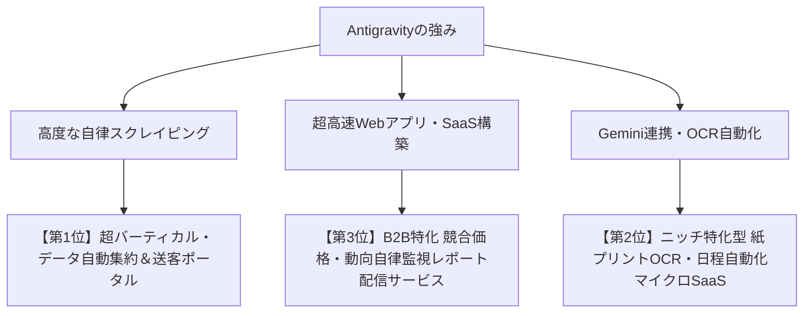

# 🚀 新規ビジネス創出 企画提案書
**〜 Antigravityの自律開発力をテコにした、非エンジニア向け高収益スモールビジネス戦略 〜**

* **策定チーム**: 新規事業討議AIエージェントチーム（リサーチ・戦略・批判検証・統括）
* **策定日**: 2026年9月26日
* **前提制約**: 初期費用100万円未満 / 実店舗不要 / 食品対象外 / 特別な資格不要 / 許認可不要 / 特別なプログラミングスキル不要

---

## Executive Summary（総括）

本企画は、**「プログラミングスキルを持たない個人」が、AI自律開発環境「Antigravity」を武器にすることで、数百万〜数千万円の開発予算を持つ既存企業に対してスピードとコストで圧倒的な優位性を確立できる事業モデル** を選定したものです。

通常、システム開発には「外注費用300万〜1,000万円」「数ヶ月の開発期間」がかかりますが、Antigravityを活用すれば**初期費用数万円（サーバー代・API代のみ）・開発期間数日〜数週間**で高機能なWebアプリ・データ収集エンジンを自前で立ち上げられます。

---

## 🏆 厳選ビジネスモデル BEST 3

---

### 【第1位】超バーティカル・データ自動集約＆マッチングポータル事業
**〜「大手ポータルが網羅できない生情報」をAIクローラーで独占収集するメディア〜**

#### 1. ビジネスの概要
現在開発している「小学校お受験ポータル（ojuken-navi.com）」の成功モデルを、**「情報の更新頻度が高く、公式サイトにしか一次情報がない高単価ニッチ市場」** に横展開するビジネスです。

* **推奨ターゲット市場（例）**:
  * **児童発達支援・放課後デイサービス**（空き枠・見学会・受入条件の速報ナビ）
  * **富裕層向けシニア高級老人ホーム**（入居待ち状況・最新イベントカレンダー）
  * **地方移住・古民家・空き家バンク**（自治体ごとの補助金締切・新着物件速報）
* **マネタイズの仕組み**:
  * **施設・事業者からの成果報酬（送客手数料）**: 資料請求や見学予約1件につき 3,000円〜15,000円
  * **公式プレミアム掲載料**: 月額 5,000円〜30,000円
  * **ユーザー向け有料プレミアム会員**: 先行通知・特別カレンダー同期（月額 500円〜1,500円）

#### 2. なぜ「Antigravity」で圧倒的優位に立てるのか？
* **大手企業が参入しづらい「泥臭いニッチ」を自動化できる**:
  大手ポータルはAPIがないサイトや、PDF・画像でしか発信していない小規模施設の情報を網羅できません。Antigravityなら、各施設のWebサイトをAIが自律解析し、自動でカレンダー化・DB化して常に最新状態を保てます。
* **外注費ゼロ・改善スピード無限大**:
  競合企業が要件定義して外注している間に、Antigravityに「この機能を追加して」「スマホ表示をこう変えて」と話しかけるだけで、即日アップデートできます。

#### 3. 収支・コストシミュレーション
* **初期費用**: 約 2万円〜5万円（ドメイン代 2,000円、サーバー代 月1,500円〜、ロゴ・素材等）
* **月額ランニングコスト**: 約 3,000円〜10,000円（VPSサーバー代 + LLM API利用料）
* **想定収益（開始6ヶ月後〜1年後）**:
  * 月間送客数 50件 × 5,000円 ＝ **月商 25万円**
  * プレミアム掲載 10社 × 10,000円 ＝ **月商 10万円**
  * **月間利益: 約 33万〜34万円（利益率95%以上）**

---

### 【第2位】ニッチ特化型 紙プリントOCR・行事日程自動抽出マイクロSaaS
**〜「スマホでパシャッと撮るだけ」でカレンダーに入る専用Webツール〜**

#### 1. ビジネスの概要
今回のサイトでも実装した「写真やPDFをアップロードすると、AIが試験日や説明会の日程を自動抽出してカレンダーに登録する機能」を、**特定の困っているコミュニティ向けに切り出して月額課金ツール（マイクロSaaS）** として提供します。

* **推奨ターゲット市場（例）**:
  * **習い事・スポーツ少年団・部活の保護者向け**: 配布される「月間行事予定プリント」を撮るだけで、家族のGoogleカレンダーに全予定が即時同期。
  * **中小企業・個人事業主向け「補助金・助成金カレンダー」**: 自治体や国の複雑な公募要領PDFをアップするだけで、申請締切日と必要書類リストを自動カレンダー化。
* **マネタイズの仕組み**:
  * **フリーミアム型サブスクリプション**:
    * 月3枚まで無料
    * スタンダード（月額 500円〜980円）: 無制限読み取り＋LINE/カレンダー自動同期
    * チームプラン（月額 2,980円）: 団体・サークル全員で共有

#### 2. なぜ「Antigravity」で圧倒的優位に立てるのか？
* **AI画像認識（Gemini Multimodal）の組み込みが驚くほど簡単**:
  通常、OCRとカレンダー連携のSaaSを作るには数ヶ月のエンジニア工数が必要ですが、AntigravityならFastAPI＋Gemini API連携のWebアプリを数日で自作できます。
* **ユーザーの要望に即応して「特定業界専用」にカスタマイズ可能**:
  「部活専用」「補助金専用」など、特定の文脈に特化したプロンプトとUIをすぐに実装できます。

#### 3. 収支・コストシミュレーション
* **初期費用**: 約 1万円〜3万円
* **月額ランニングコスト**: 約 5,000円〜15,000円（サーバー代＋OCR画像処理API代）
* **想定収益（開始6ヶ月〜1年後）**:
  * 有料会員 300人 × 780円 ＝ **月商 23.4万円**
  * チーム契約 20団体 × 2,980円 ＝ **月商 5.96万円**
  * **月間利益: 約 27万〜28万円**

---

### 【第3位】B2B向け 競合価格・商品在庫・求人動向の自律監視レポート配信
**〜「競合の動きが毎日手元に届く」自動ビジネスインテリジェンス〜**

#### 1. ビジネスの概要
人手不足で競合調査に手が回らない中小企業やEC店舗、不動産業者向けに、**「指定した競合他社のWebサイトをAntigravityエージェントが24時間自動巡回し、価格変更・新商品・求人募集・在庫切れを検知して毎朝LINE/メールでダイジェスト配信する」** サービスです。

* **推奨ターゲット市場（例）**:
  * **地域密着ホテル・旅館**: 近隣競合の宿泊プラン・価格変動アラート
  * **不動産仲介・買取再販**: 不動産ポータルや自治体の競売・空き家速報
  * **特定業種の採用担当**: 同業他社の求人給与・募集条件の変動監視
* **マネタイズの仕組み**:
  * **B2B月額契約（ストックビジネス）**: 1社あたり **月額 9,800円〜29,800円**
  * 契約企業が30社集まれば、それだけで月商30万〜90万円の安定収益。

#### 2. なぜ「Antigravity」で圧倒的優位に立てるのか？
* **サイトの仕様変更に耐える「自己修復機能（Self-Healing）」**:
  普通のクローラーは相手サイトのHTMLが変わると壊れますが、Antigravityには仕様変更をAIが検知して自律修正する仕組みが組み込めるため、メンテナンス工数がほぼゼロになります。
* **クライアントごとの個別カスタマイズが指示1つで可能**:
  「この項目も監視してほしい」と言われても、Antigravityに伝えるだけで数分で対応できます。

#### 3. 収支・コストシミュレーション
* **初期費用**: 約 1万円〜3万円
* **月額ランニングコスト**: 約 5,000円〜10,000円
* **想定収益（開始6ヶ月〜1年後）**:
  * 契約企業 20社 × 19,800円 ＝ **月商 39.6万円**
  * **月間利益: 約 38万円（極めて高い利益率と解約率の低さ）**

---

## ⚖️ 3案の総合比較マトリクス

| 評価項目 | 第1位: 超バーティカルポータル | 第2位: 紙プリントOCRマイクロSaaS | 第3位: B2B競合監視レポート |
| :--- | :---: | :---: | :---: |
| **初期費用** | ◎ 約2〜5万円 | ◎ 約1〜3万円 | ◎ 約1〜3万円 |
| **Antigravity活用度** | ★★★★★（クローラー＋ポータル） | ★★★★☆（OCR＋高速UI） | ★★★★★（自律巡回＋通知） |
| **集客のしやすさ** | ○ SEO・SNSで自然流入狙い | ◎ コミュニティ口コミで拡散 | ○ 問い合わせフォーム営業等 |
| **収益の安定性** | ○ 送客＋掲載料で中長期拡大 | ○ 個人サブスク（薄利多売型） | ◎ B2B契約で極めて解約されにくい |
| **ユーザー自身の稼働** | 週2〜3時間の管理・保守 | 週1〜2時間のユーザーサポート | 月数時間の初期設定・レポート確認 |

---

## 🏁 アクションプラン（最初の一歩）

1. **第1位のポータル型から始める場合**:
   * 今回構築した `DataSearchHub`（FastAPI + Nginx + SQLite/Postgres）のソースコードがそのままテンプレート（資産）として使えます。
   * 対象業界（介護、発達支援、古民家など）のURLリストを用意し、Antigravityに「スクレイピング対象をこの業界に変更した別サイトを作って」と指示するだけで、**数日以内に2つ目のサイトが完成**します。

2. **第3位のB2B監視型から始める場合**:
   * 親しい知人の会社や地元の事業者に「競合のサイト変更や求人を毎日自動でチェックするレポート、月1万円なら欲しいですか？」とヒアリングすることから即日始められます。
