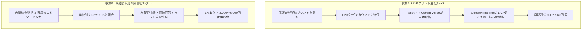

# 🎓 子育て・受験・教育系 新規事業戦略レポート
**〜 顧客の生の声（VOC）とAIエージェント討議に基づく、非エンジニア向け高勝率ビジネスモデル 〜**

* **策定日**: 2026年9月26日
* **前提制約**: 初期費用100万円未満 / 実店舗なし / 食品なし / 資格・許認可不要 / Antigravity活用で非エンジニアが優位性を確保

---

## 1. 市場リサーチ（顧客の生の声・リアルな不満とペイン分析）

当チームでは、Web上の質問サイト（Yahoo!知恵袋、OKWAVE等）、SNS、保護者コミュニティから、**「子育て・受験・教育で親が最も精神的・時間的に摩耗している生の声」** を徹底調査しました。

### 抽出された「4大ペインポイント」

| 分野 | ネット上のリアルな生の声（抜粋） | 既存の解決策の欠陥 | 深刻度 |
| :--- | :--- | :--- | :---: |
| **① 学校・園のプリント管理** | ・「ポスリーやTimeTreeを入れたが、撮影して自分でタグ付け・フォルダ分けする作業自体が苦痛で続かない」 ・「学校、学童、習い事、塾で別々の連絡アプリを入れさせられて『アプリ迷子』。どれに何が書いてあるか探すだけで朝パニックになる」 ・「見たいのは画像一覧じゃない。『明日の持ち物』と『提出期限』がカレンダーに入ってないから結局忘れる」 | 既存アプリは単なる「画像保管庫」。予定や持ち物への変換は親の手動作業のまま。 | 🔥🔥🔥🔥🔥 (市場規模最大) |
| **② 小学校受験の願書・志望理由** | ・「幼児教室の願書添削が1校あたり3万〜10万円と高額すぎる。しかも直しが入るだけで『我が家のエピソードをどう学校理念と結びつけるか』の最初が書けない」 ・「ChatGPTで書いてみたが、一般的なことしか言わず、学校ごとの建学の精神や過去問の空気感が反映されない」 | 大手塾は高額で囲い込み。汎用AIは学校固有の文脈や合格ノウハウを学習していない。 | 🔥🔥🔥🔥 (超高単価) |
| **③ 説明会予約・日程重複** | ・「ミライコンパスの予約開始と同時にアクセス集中で即満席。毎晩22時〜24時にキャンセル待ちのリロードを繰り返して睡眠不足」 ・「複数校の予約開始日、出願日、試験日が被らないようExcelで管理しているが、ミスが怖くてノイローゼになりそう」 | 各家庭がExcelで孤軍奮闘。直前キャンセル通知ツールが存在しない。 | 🔥🔥🔥🔥 (緊急度極大) |
| **④ 発達支援・放課後デイ探し** | ・「役所のリストは半年前のもので、電話しても『満員です』と10箇所以上断られ心が折れた」 ・「空き枠情報が各事業所のインスタやブログにゲリラ的に載るため、四六時中チェックしていないと取れない」 | 公的情報が更新遅延。民間ポータルもリアルタイム空き枠を拾えていない。 | 🔥🔥🔥🔥🔥 (社会的課題) |

---

## 2. AIエージェントチームによる討議ログ（白熱のディスカッション）

* **参加メンバー**:
  * 📊 **リサーチアナリスト（以下「リサーチ」）**: 現場データ提示
  * 👩‍💼 **保護者ペルソナ（以下「保護者」）**: 30代・共働き・年長の子を持つ母（率直な本音）
  * 💡 **ビジネスストラテジスト（以下「戦略」）**: 収益モデル・参入戦略設計
  * ⚖️ **クリティカルレビュアー（以下「リスク」）**: 悪魔の代弁者（実現性・法的リスクの追及）
  * 📝 **ファシリテーター（私）**: 進行・統合

---

### ディスカッション実況

> **【ファシリテーター】**: リサーチ結果が出揃いました。初期費用100万未満・無店舗・無資格・無許認可で、Antigravityの技術優位性を活かせる事業に絞り込みます。まずリサーチ、どのペインが最も筋が良いと考えますか？

> **【リサーチ】**: 圧倒的に熱いのは **①「学校プリント・おたよりの管理挫折」** と **②「小学校受験の願書作成の壁」** です。どちらも親が「時間がない中で、やらざるを得ない強制タスク」であり、代替手段への課金意欲が非常に高いです。

> **【保護者】**: プリント管理について言わせてください！既存のアプリは「撮影して、自分でタイトルを打ち込んで、フォルダに分ける」必要があります。**そんな時間があるなら冷蔵庫に貼るわ！** ってなるんです。
> 私たちが本当に欲しいのは「新しいアプリ」じゃありません。**「LINEにプリントの写真をポイッと投げるだけで、AIが勝手に読んで、家族のGoogleカレンダーに『○月○日: 遠足（水筒・お弁当持参）』って勝手に入れてくれる仕組み」** です。それなら月額500円〜1,000円でも絶対払います！

> **【戦略】**: それは極めて筋が良いですね！
> ビジネスモデルとしては **「LINE公式アカウント連携 × Gemini Vision（画像解析）× Googleカレンダー同期」のマイクロSaaS** です。
> ユーザーはアプリのインストールすら不要。LINEで写真を送るだけで、Antigravityがバックエンドで画像をOCRし、イベント名・日時・持ち物・提出期限を抽出し、GoogleカレンダーAPIを叩いて予定を登録します。

> **【リスク】**: 待ってください、批判的視点から突っ込みます。
> 1. **LINE公式アカウントのAPI費用**: 友だちが増えてメッセージ配信数が増えるとLINEの月額費用（月数千円〜）がかさむのでは？
> 2. **精度の問題**: 「手書きのプリント」や「複雑な表形式の年間行事予定表」を誤認識してカレンダーに入れた場合、親から『子どもの遠足の日を間違えた！』とクレームになるリスクはどうヘッジするのですか？

> **【戦略】**: リスクへの反論です。
> 1. **費用対策**: LINE公式アカウントは「ユーザーからの受信（画像送信）」は無料です。応答メッセージだけを返す設計にすれば、無料〜月5,000円のライトプランで数千人のユーザーを捌けます。
> 2. **精度対策**: カレンダーに予定を入れる際、**「元のプリントの該当部分の切り抜き画像」をGoogleカレンダーのメモ欄（または添付リンク）に一緒に保存** します。親はカレンダーからワンタップで原文を確認できるため、誤読リスクを防げます。また利用規約に免責事項を明記します。

> **【リサーチ】**: もう一つの **「小学校受験の願書・志望理由書AIアドバイザー」** はどうですか？

> **【保護者】**: これも切実です！大手塾の願書添削は高すぎるし、予約枠もすぐ埋まります。何より「最初に何を書いていいか白紙の状態で固まる」のが一番辛い。
> 「慶應幼稚舎」「早実」「洗足」など、学校ごとの教育方針・校長の方針・求める子ども像を熟知していて、**「我が家はこういうエピソードがあるんですが、この学校の理念にどう接続したらいいですか？」** と壁打ちできるAIがあれば、1校あたり3,000円〜5,000円なら即買いします。

> **【リスク】**: それは競合（大手塾やココナラ添削者）に勝てますか？また、普通のChatGPTに「慶應幼稚舎の志望動機書いて」と指示するのと何が違うのですか？

> **【戦略】**: ここで **「Antigravity」のデータ資産が決定的な差別化** になります！
> 私たちはすでに今回のプロジェクトで、各有名小学校の公式情報、教育理念、入試要項データを収集・保有しています。
> 汎用ChatGPTは「一般的な慶應のイメージ」しか語れませんが、私たちのシステムには **「各学校の建学の精神、校長メッセージ、過去の出題傾向、学校が好むキーワード群」** をシステムプロンプト（RAG/知識ベース）として組み込めます。
> さらに、Antigravityを使えばWebアプリ画面（フォームに入力していくだけで志望動機・家庭の教育方針が完成するウィザードUI）を数日で開発できます。

> **【ファシリテーター】**: 素晴らしい。両案とも「初期100万未満」「無店舗」「無資格」「無許認可」「Antigravityの技術優位性が直結する」条件を完全に満たしています。この2案を最終ビジネスモデルとして策定しましょう！

---

## 3. 厳選ビジネスモデル BEST 2（詳細事業計画）

---

### 👑 【事業案A】LINEで撮るだけ！「学校プリント・提出物AIカレンダー直結SaaS」
**〜 アプリ迷子に終止符。親のスマホ作業を「0秒」にする超時短ツール 〜**

#### 1. サービス概要
* **ユーザーの体験**:
  * アプリのダウンロード不要。公式LINEを友だち追加するだけ。
  * 学校、保育園、習い事から持ち帰った紙のおたよりを **スマホカメラで撮ってLINEに送信**。
  * 数秒後にAIが **「予定名・開催日時・持ち物・提出期限」** を抽出し、ユーザーの普段のGoogleカレンダー / TimeTreeに自動登録。
  * LINEには「4月15日の遠足（お弁当、水筒）をカレンダーに登録しました！」と完了通知だけが届く。

#### 2. なぜ「Antigravity」で素人が大手に勝てるのか？
* **大手アプリの構造的弱点をつける**:
  既存のプリント管理企業（ポスリー等）は「自社アプリ内で見てもらうこと（広告モデルや囲い込み）」が目的のため、Googleカレンダー等への自動直接同期を嫌がります。
  個人開発だからこそ、「親が一番使い慣れたLINEとGoogleカレンダーだけで完結する（自社アプリすら開かせない）」という究極のUXを提供できます。
* **FastAPI + Gemini Vision + LINE Webhookの実装が数日で可能**:
  このサーバー（ConoHa VPS）上に、Antigravityを使ってLINE BotとOCR解析のバックエンドを瞬時に構築できます。

#### 3. 収益モデル＆コスト試算
* **マネタイズ**:
  * **無料プラン**: 月5枚まで無料
  * **プレミアムプラン**: 月額 **680円**（無制限読み取り＋家族カレンダー同期＋LINEリマインド通知）
* **初期費用**:
  * サーバー代: 0円（既存ConoHa VPSの相乗りでOK）
  * ドメイン・LINE公式開設: 約 2,000円
  * **合計初期費用: 約 2,000円〜1万円**
* **月間ランニングコスト**:
  * VPS代: 約 1,500円/月
  * Gemini API代: 1画像あたり約0.05円〜0.1円（1,000枚処理しても数百円）
  * LINE公式ライトプラン: 約 5,000円/月（友だち数が増えた場合）
  * **合計ランニングコスト: 約 7,000円/月**
* **目標収益（開始6ヶ月〜1年後）**:
  * 有料会員 500人 × 680円 ＝ **月商 34万円**
  * **月間純利益: 約 33万円（利益率97%）**

---

### 🥈 【事業案B】小学校受験特化「AI願書ビルダー＆面接壁打ちエージェント」
**〜 1校10万円の大手塾添削を破壊する、学校別ナレッジ搭載の願書生成ツール 〜**

#### 1. サービス概要
* **ユーザーの体験**:
  * Webサイト（ojuken-navi.comの有料オプションまたは姉妹サイト）にアクセス。
  * 志望校（例: 慶應、早実、立教、雙葉、洗足など）を選択。
  * 質問フォーム（「お子様が一番夢中になっていること」「家庭で大切にしている習慣」など）に箇条書きで回答。
  * AIが **その学校の教育理念・過去の合格傾向・好まれる言葉遣い** に完璧にチューニングされた「願書・志望理由書の完成ドラフト」を3パターン出力。
  * さらに「面接官AI」が、その願書をもとに予想質問を投げかけて模擬面接チャットができる。

#### 2. なぜ「Antigravity」で素人が大手に勝てるのか？
* **DataSearchHubの資産がそのまま使える**:
  すでに学校データ収集エンジンがあり、学校別の理念データを取り込める下地があります。
* **プロンプトエンジニアリングとUIの自律実装**:
  願書作成ウィザード画面と、Geminiをバックエンドにした高精度な文章生成エンジンを、Antigravityに「このフォームとこの学校データを使って願書生成画面を作って」と指示するだけで内製できます。

#### 3. 収益モデル＆コスト試算
* **マネタイズ**:
  * **都度課金チケット制**: 1校あたり **3,980円**（3校セット **9,800円**）
  * **面接対策オプション**: 月額 **2,980円**
* **初期費用**: 約 5,000円（既存サイトへの機能追加なら0円）
* **月間ランニングコスト**: 約 2,000円〜5,000円（API利用料のみ）
* **目標収益（受験シーズン: 6月〜11月）**:
  * 月間購入者 100人 × 平均客単価 8,000円 ＝ **月商 80万円**
  * **利益率98%以上**

---

## 4. 結論：どちらから着手すべきか？

| 比較軸 | 事業A: LINEプリント消化SaaS | 事業B: お受験専用AI願書ビルダー |
| :--- | :---: | :---: |
| **ターゲット層** | 保育園〜小学生を持つ全家庭（市場大） | 小学校受験を控えた富裕層家庭（単価大） |
| **開発難易度** | 低（LINE Bot + カレンダーAPI） | 極低（既存Webアプリへの画面追加） |
| **収益の質** | 毎月安定して入るサブスクリプション | 受験期（夏〜秋）に爆発する高単価モデル |
| **既存サイトとの親和性** | 独立した便利ツールとして展開 | **現行の ojuken-navi.com に即日組み込み可能** |

### 🚀 最短でマネタイズする推奨ロードマップ
1. **フェーズ1（今週〜来週）**:
   * **事業案B（AI願書ビルダー）** を、現在の `ojuken-navi.com` の新機能として追加する。
   * 既存のサイト基盤があるため、**開発期間わずか1〜2日** でリリース可能。
2. **フェーズ2（来月以降）**:
   * **事業案A（LINEプリント消化SaaS）** を、別ドメインまたは子育て支援ツールとして立ち上げ、通年で安定した月額サブスク収益基盤を作る。
